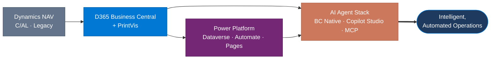

# Milos Baic

**Business Central Solution Architect & Developer · PrintVis Specialist · AI Agent Builder**

[**Focus**](#-current-focus) · [**Repositories**](#-featured-repositories) · [**Tech Stack**](#-tech-stack) · [**Certifications**](#-certifications) · [**Contact**](#-contact)

---

20 years designing and delivering ERP solutions on Microsoft Dynamics NAV and D365 Business Central, with deep specialization in **PrintVis** and a delivery record spanning Nordic and North American markets. Currently building AI-driven automation across the Microsoft agent stack — native Business Central agents, Copilot Studio agents, agent skills, and Model Context Protocol (MCP) connectivity — helping customers evolve from traditional ERP workflows to intelligent, automated operations.

> [!TIP]
> If you're working at the intersection of Business Central, PrintVis, and AI-driven automation — or building something interesting in this space — I'm always open to connecting with the right people. Find me on [LinkedIn](https://www.linkedin.com/in/milosbaic).

---

## 🧭 From ERP Workflows to Intelligent Operations

*Two decades of Dynamics ERP delivery — now compounding into agent-driven automation:*

---

## 🔭 Current Focus

- 🏗️ Architecting and delivering **D365 Business Central** and **PrintVis** solutions across Sweden and the USA
- 🔗 Integrating Business Central with **Power Platform** — Dataverse, Canvas Apps, Power Automate, Power Pages
- 🤖 Developing **native BC agents**, **Copilot Studio agents**, and **MCP server connectivity**
- ⚙️ Building clean **AL** Per Tenant Extensions with **AL-Go CI/CD** pipelines

---

## 🚀 Featured Repositories

> Tools and experiments from my BC and AI development work.

<table>
<tr>
<td width="50%" valign="top">
<b>🤖&nbsp;&nbsp;<a href="https://github.com/stars/mbaic/lists/bc-al-vsc-gh-copilot-toolkit">Agentic Coding Toolkits</a></b>  
VS Code extensions plus GitHub Copilot and Claude Code plug-ins — prompt templates, instructions, skills, and autonomous agents for AL development in Business Central  
<code>al</code>&nbsp;&nbsp;<code>copilot</code>&nbsp;&nbsp;<code>claude-code</code>&nbsp;&nbsp;<code>vscode</code>&nbsp;&nbsp;<code>business-central</code>
</td>
<td width="50%" valign="top">
<b>☁️&nbsp;&nbsp;<a href="https://github.com/stars/mbaic/lists/bc-al-codespaces">BC AL Codespaces</a></b>  
Ready-to-fork Business Central PTE template for cloud development in GitHub Codespaces — publish straight to a BC Online sandbox, no local tooling required  
<code>codespaces</code>&nbsp;&nbsp;<code>al</code>&nbsp;&nbsp;<code>business-central</code>&nbsp;&nbsp;<code>cloud-dev</code>
</td>
</tr>
<tr>
<td width="50%" valign="top">
<b>🧪&nbsp;&nbsp;<a href="https://github.com/stars/mbaic/lists/bc-al-demos">BC AL Demos</a></b>  
Business Central AL sample apps demonstrating real-world extension patterns — main extension, automated test suite, and Contoso demo data — a practical reference for building and validating PTE solutions  
<code>al</code>&nbsp;&nbsp;<code>business-central</code>&nbsp;&nbsp;<code>samples</code>&nbsp;&nbsp;<code>testing</code>
</td>
<td width="50%" valign="top">
<b>⚙️&nbsp;&nbsp;<a href="https://github.com/stars/mbaic/lists/bc-al-automation">BC AL Automation</a></b>  
PowerShell tooling for managing local Business Central Docker containers, plus AL Workspace CLI demos for compiling and mapping multi-app workspaces without VS Code  
<code>powershell</code>&nbsp;&nbsp;<code>docker</code>&nbsp;&nbsp;<code>al-cli</code>&nbsp;&nbsp;<code>business-central</code>
</td>
</tr>
</table>

---

## 🧰 Tech Stack

| Domain | Tools & Platforms |
|:--|:--|
| 🧱 **ERP Platform** |   [-64748B?style=for-the-badge)](https://learn.microsoft.com/en-us/dynamics-nav/) |
| 💻 **Languages & Development** |   [-00B7C3?style=for-the-badge)](https://learn.microsoft.com/en-us/dynamics-nav/programming-in-c-al)    |
| ☁️ **Cloud & Power Platform** |   |
| ⚙️ **DevOps & CI/CD** |    |
| 🤖 **AI & Agent Stack** |   [-6D28D9?style=for-the-badge)](https://learn.microsoft.com/en-us/dynamics365/business-central/dev-itpro/ai/configure-mcp-server)  |

---

## 📚 Certifications

| 🎓 Earned | 🎯 In Progress |
|:--:|:--:|
|     |  |

---

## 📞 Contact

| | |
|---|---|
| 💼 **LinkedIn** | [linkedin.com/in/milos_baic](https://www.linkedin.com/in/milosbaic) |
| 📍 **Location** | Gothenburg, Sweden (UTC+1/+2) |

---

Open for knowledge sharing across Business Central, PrintVis, related Azure and Power Platform topics, and AI/Agent solutions.

